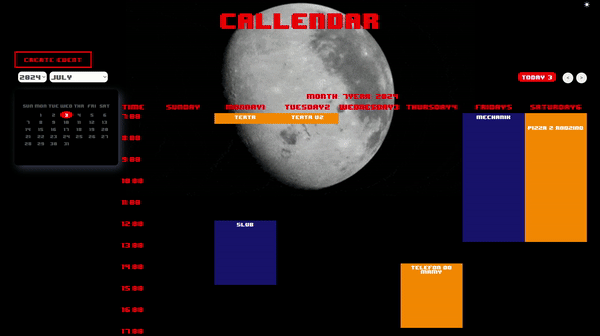
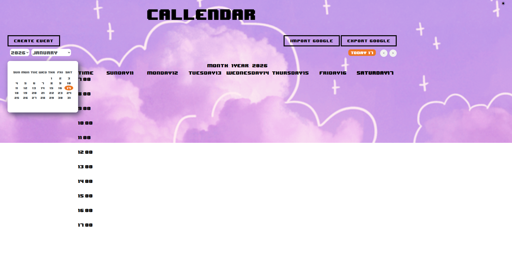

# Google Calendar App

This project implements a Google Calendar application that allows users to create, edit, and delete events/tasks for multiple people. Each person receives an email notification and must confirm their attendance. The application includes unit tests using JUnit and plans for future integration with Google Calendar synchronization.

# Gif's

  

## Features
-Create Events: Users can create events/tasks specifying details like title, date, time, and attendees.

-Email Confirmation: Each attendee receives an email notification and needs to confirm their attendance.

-Edit and Delete Events: Users can modify event details or remove events entirely.

-JUnit Tests: Includes comprehensive unit tests using JUnit to ensure code reliability.

-feature to synchronize events with Google Calendar for seamless integration.

-dark/white mode

## Future Enhancements

-UI Improvements: Enhance user interface for better usability.

-Additional Features: Add more features based on user feedback.
